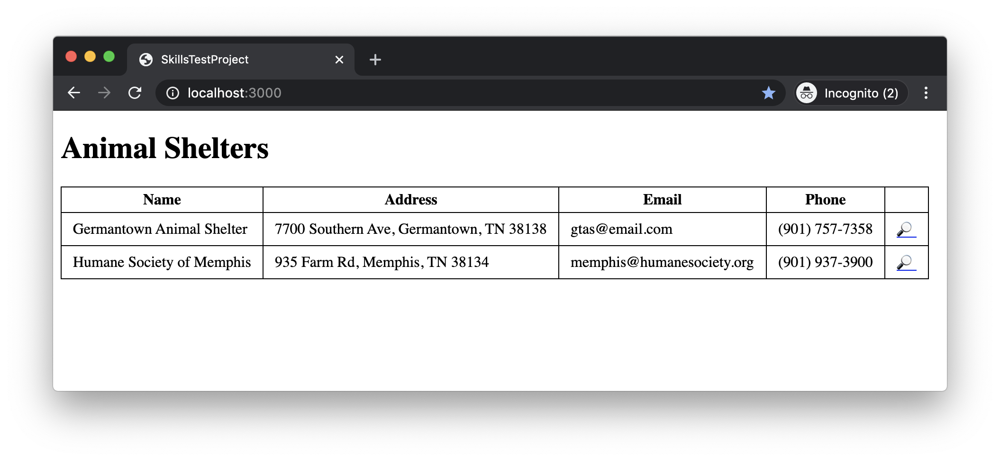
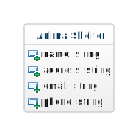
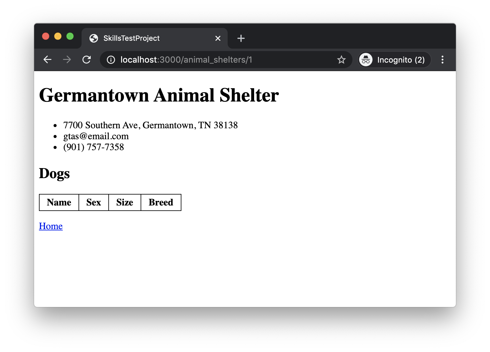
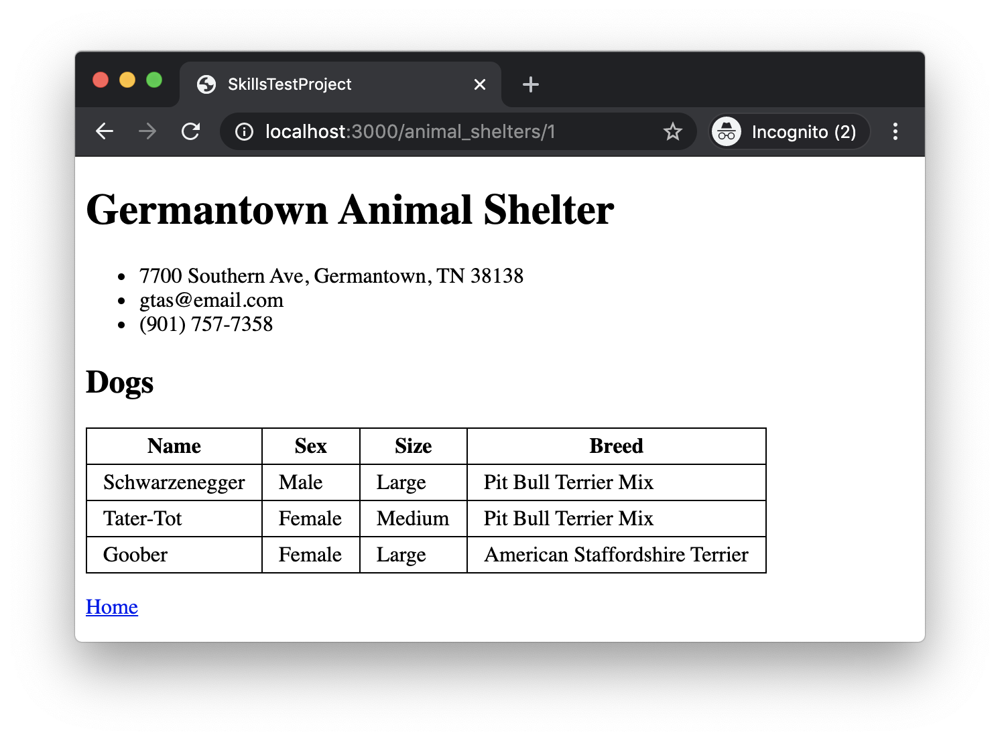
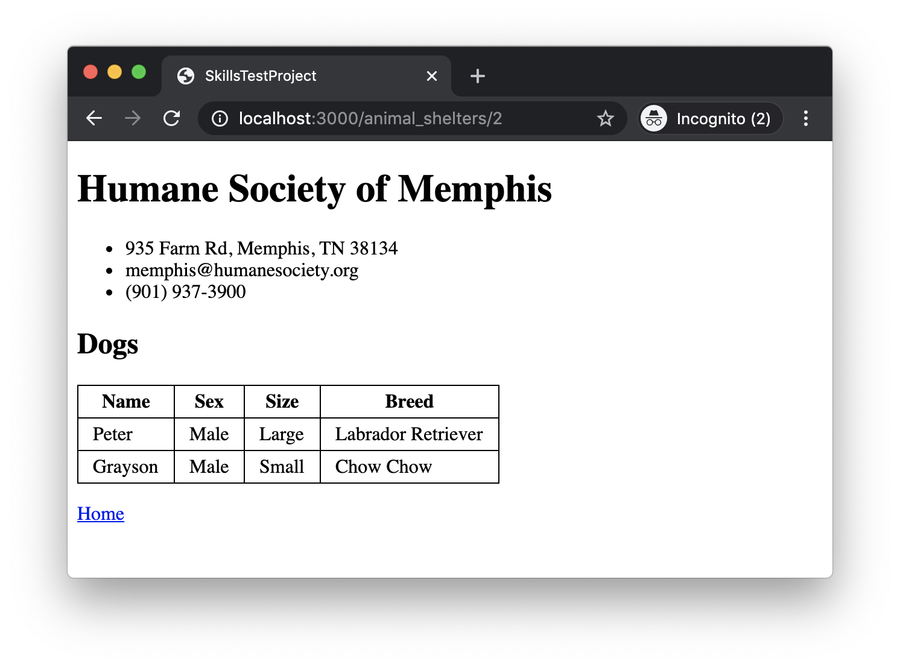

# Special Skills Test

Be sure that you are familiar with and have completed all the necessary [Skills Test instructions](https://memphis-cs.github.io/comp-4081/skills-test-instructions/) before beginning this test.

## Part 1. Starting the Test

1. In the terminal, verify that your working directory is clean:

    ```bash
    git status
    ```

    If there are any uncommitted changes or any untracked files in your working directory, then you will need to do something about them before proceeding. For example, you might simply commit them all these familiar commands:

    ```bash
    git add -A
    git commit -m "Old stuff"
    ```

1. In the terminal, download and checkout the branch for the test:

    ```bash
    git fetch
    git checkout --track origin/special-test
    ```

1. Initialize the project by doing the following:
   1. Install the Gems for the project using `bundle`.
   1. Install the JavaScript dependencies for the project using `yarn`.

1. Delete any old junk in the database, and reset it for the current test.

    1. Drop (i.e., delete) all databases (note that this command doesn't change the `schema.rb`):

        ```bash
        rails db:drop
        ```

    1. Create new empty databases (i.e., with no tables):

        ```bash
        rails db:create
        ```

    1. Clear the `schema.rb` file (technically, this command regenerates the `schema.rb` file based on the database, but since our database has no tables, we are effectively using it to clear the `schema.rb` file):

        ```bash
        rails db:schema:dump
        ```

    1. Because we now have an empty `schema.rb` file, we can completely regenerate it, as well as create empty tables in the database, using the following command:

        ```bash
        rails db:migrate
        ```

    1. Finally, seed the database tables with data:

        ```bash
        rails db:seed
        ```

You should now be able to run the Rails web server and view the page <http://localhost:3000/> in your web browser. You should see an `index` page that looks like this:



## Part 2. Development Tasks

For this test, you have been given a partially complete Rails app, and it is your job to complete the app.

### The Current State of the (Incomplete) App

Currently, the app has the following model:



In its current (incomplete) state, the app works as follows.

On the `index` page, when the user clicks the `🔎` link, a partially implemented `show` page is displayed. For example, if you clicked the `🔎` link next to the first record in the table, you would see a `show` page that looks like this:



The key thing that is incomplete here is the table of associated dog records. Only the table headings are currently being displayed.

### How You Must Complete the App

Your task for this test is to complete this Rails app such that three key changes are made:

1. Update the model classes.
1. Add new seed data.
1. Complete the `show` page.

The model should be updated as per this diagram:


Note that there is a new model class (`Dog`) and an association between the model classes has been added.

The `show` page must be updated to display the `Dog` records associated with each `AnimalShelter`.

To finish the task, complete the `show` page and add seed data such that the existing `show` pages look like this:





For ease of entering `Dog` data, here is a table from which you can copy/paste those data:

| Name | Sex | Size | Breed |
| ---- | --- | ---- | ----- |
| Schwarzenegger | Male | Large | Pit Bull Terrier Mix |
| Tater-Tot | Female | Medium | Pit Bull Terrier Mix |
| Goober | Female | Large | American Staffordshire Terrier |
| Peter | Male | Large | Labrador Retriever |
| Grayson | Male | Small | Chow Chow |

## Part 3. Test Submission

Once you've completed all of the above, submit your work by doing the following:

1. Commit all your changes to the local repo.

1. Generate a ZIP archive of your project by running the following command from within the top-level folder of your project's working directory:

    ```bash
    git archive -o ../special-test-submission.zip --prefix=special-test-submission/ HEAD
    ```

    This command should result in a file `special-test-submission.zip` being created in your `workspace` folder.

1. Email your zip file to [Scott.Fleming@memphis.edu](mailto:Scott.Fleming@memphis.edu) and [Jeff.Atkinson@memphis.edu](mailto:Jeff.Atkinson@memphis.edu) with the subject "`COMP 4081 Special Test Submission`".

    **This step must be completed by the end of the test time.**
